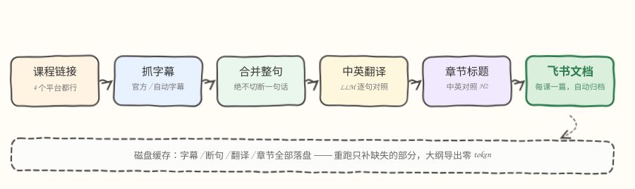
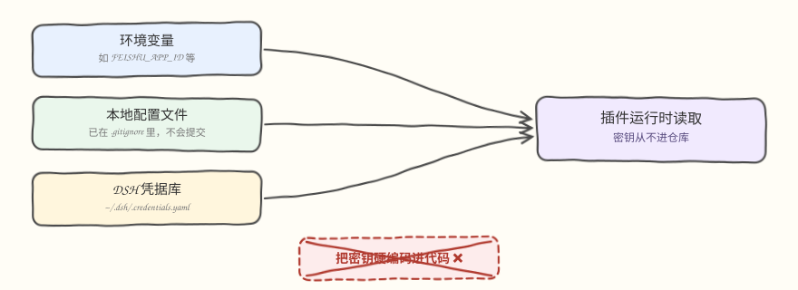

# dsh-course-subtitles

> 把视频课程的字幕抓下来 → 重排成完整句子 → 逐句中英对照翻译 → 自动分章节 → 一课一篇写进飞书文档。

[](https://beancookie.github.io/awesome-dsh-plugin)

一个 [DeepSeek Harness](https://github.com/deepseek-ai/deepseek-harness)（`dsh`）插件。装好以后，在 DSH 对话里说一句「帮我跑一下课程字幕」就行。

**适合谁用**：想把 DeepLearning.AI / YouTube / B 站上的课程变成**可搜索、带中英对照的学习笔记**的人。

---

## 它到底做了什么

<p align="center"></p>

最终你得到一篇飞书文档，长这样：

```
# 01 Welcome 欢迎                          ← 课程标题（自动中文翻译）
第 1 周 · 视频时长 4:32 · 生成时间 2026-01-01   ← 元信息

## What is Generative AI? 什么是生成式AI？   ← 自动生成的章节标题（中英对照）

Generative AI is a general purpose technology.   ← 英文原句
生成式 AI 是一种通用技术。                          ← 中文翻译

...
```

另外还可以把课程首页的目录导出成一篇大纲文档 —— **不调用任何模型，零 token 花费**。

---

## 支持哪些平台

| 平台 | 链接形式 | 需要什么 |
|---|---|---|
| **DeepLearning.AI** | `learn.deeplearning.ai/courses/...` | 无需登录，官方字幕 |
| **YouTube** | `youtube.com/watch?v=...`、`youtu.be/...`、播放列表 | 能访问 YouTube（国内需要本地代理，插件会自动识别） |
| **Bilibili** | `bilibili.com/video/BV...` | UP 主上传过字幕轨（AI 字幕也算） |
| **Coursera** | `coursera.org/learn/...` | 需要登录 Cookie（实验性支持） |

---

## 快速开始

### 第 1 步：准备三样东西

1. **Node.js ≥ 18**（`node -v` 检查）
2. **一个飞书自建应用**（用来写文档）
   - 去 [飞书开放平台](https://open.feishu.cn/app) 创建「企业自建应用」
   - 在「权限管理」里开通：`wiki:wiki`、`docx:document`、`drive:drive`
   - 发布版本，拿到 **App ID** 和 **App Secret**
   - ⚠️ 关键一步：打开你要写入的**知识库 → 设置 → 成员管理 → 添加应用**，把这个应用加进去，否则会报权限错误
3. **一个 LLM API Key**：DeepSeek 官方（`https://api.deepseek.com`）或任何 OpenAI 兼容服务都行

### 第 2 步：安装插件

```bash
dsh plugin --profile web add github:fengchang618gmail/dsh-course-subtitles
```

装好后重启 DSH（退出后重新运行 `dsh --profile web`）。

### 第 3 步：配置密钥

在启动 DSH 的终端里设置环境变量，然后正常启动 DSH 即可：

```bash
# macOS / Linux
export FEISHU_APP_ID=cli_xxxxxxxxxxxx
export FEISHU_APP_SECRET=xxxxxxxxxxxxxxxx
export DEEPSEEK_API_KEY=sk-xxxxxxxxxxxx

# Windows PowerShell
$env:FEISHU_APP_ID="cli_xxxxxxxxxxxx"
$env:FEISHU_APP_SECRET="xxxxxxxxxxxxxxxx"
$env:DEEPSEEK_API_KEY="sk-xxxxxxxxxxxx"
```

密钥只在运行时从环境里读取，不会写进任何代码或仓库。

### 第 4 步：在对话里使用

第一次用之前，把课程地址和飞书目录写进设置文档 `$DSH_HOME/settings.yaml` 的 `course-subtitles:` 段：

```yaml
course-subtitles:
  courseUrl: https://learn.deeplearning.ai/courses/generative-ai-for-everyone
  feishuParent: https://你的租户.feishu.cn/wiki/xxxxxxxxxxxxxxxxxxxx
```

之后只要对 agent 说一句：

> 帮我跑一下课程字幕

agent 会调用这几个工具（通常你不用关心名字）：

| 工具 | 作用 |
|---|---|
| `course_subtitles_run` | 抓字幕 → 翻译 → 分章节 → 写飞书，返回 run id |
| `course_outline_run` | 只导出课程大纲（零 token） |
| `course_subtitles_status` | 查看运行进度和产出文档链接 |
| `course_proxy_status` | 网络自检：本机代理能不能出网、yt-dlp 在不在 |
| `course_llm_status` | 列出会依次尝试的 LLM 凭据 |

---

## 关于密钥：仓库里没有任何密钥

<p align="center"></p>

这个项目**不包含、不需要、也不接受**硬编码的 API Key。

另外：如果首选的 LLM key 挂了（余额不足、被限流），插件会**自动依次尝试本机已有的其它凭据**，不用手动切换。

---

## 常见问题

**Q：报飞书权限错误 / 403？**
这个应用必须被加进目标知识库：知识库 → 设置 → 成员管理 → 添加应用。同时确认已开通 `wiki:wiki`、`docx:document`、`drive:drive` 权限并发布了版本。

**Q：YouTube 一直失败？**
国内直连 YouTube 一定失败，需要本地代理（v2rayN / Clash 等，开着就行，插件会自动识别）。还是不行的话，对 agent 说「检查一下网络代理」，它会告诉你具体卡在哪。

**Q：跑一遍要花多少钱？**
一个 32 课的课程大约 16 万 token，DeepSeek 上约 ¥1–2。重跑不会重复花钱 —— 字幕、断句、翻译、章节都做了磁盘缓存，只补缺失的部分。**大纲导出完全不花钱。**

**Q：会不会把一句话从中间切断？**
不会。字幕片段会先合并成完整句子，段落始终由原始片段程序化拼接，不增字、不删字；章节标题也只允许落在句子边界上。

---

技术细节、已知限制、命令行用法和自测脚本，见 **[docs/REFERENCE.md](docs/REFERENCE.md)**。

## 许可

[MIT](LICENSE)
